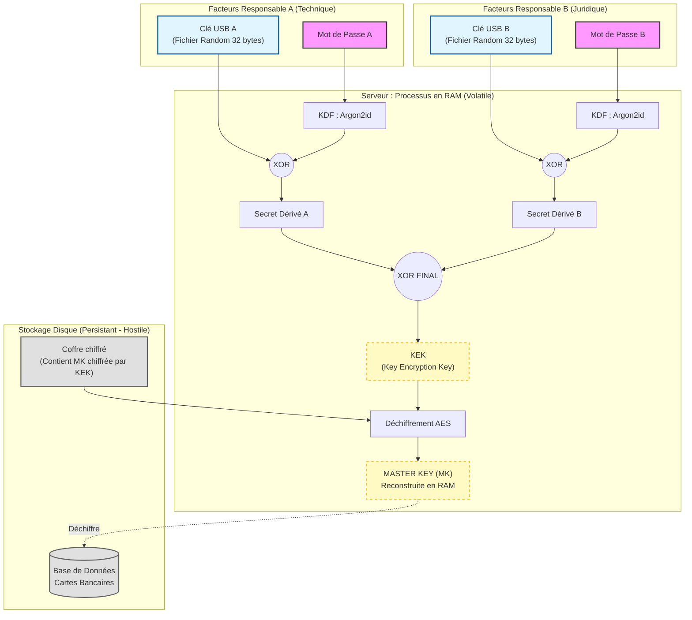
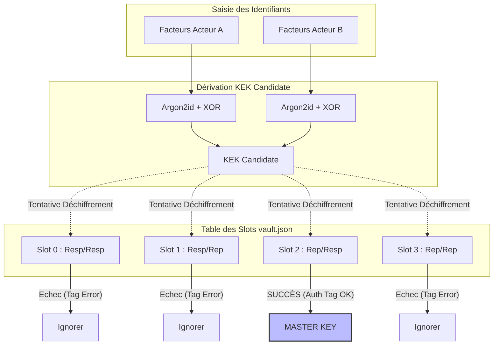
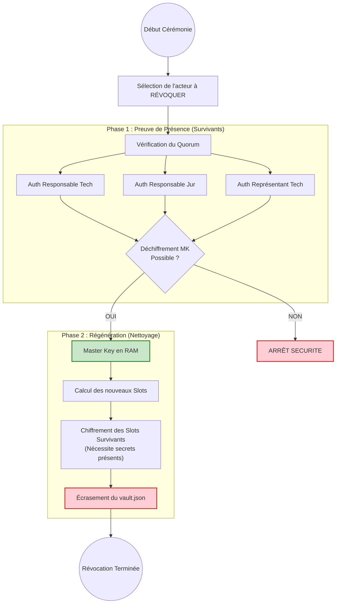

# Architecture de Sécurité & Gestion des Secrets

## 1. Architecture de Sécurité & Gestion des Secrets

### 1.1. Réponse à la problématique de Sécurité par Conception (Security by Design)

**Problématique :**
Conformément aux exigences du GIE Cartes Bancaires, le serveur doit garantir la **confidentialité des données stockées** sans que la sécurité ne repose sur le stockage disque, l'intégrité du système d'exploitation, ou la confiance en un administrateur unique. Le déchiffrement doit impérativement nécessiter la présence simultanée de **deux responsables authentifiés par deux facteurs**.

**Solution Proposée : Le Chiffrement par Enveloppe (Key Wrapping) et Secret Partagé.**
Notre architecture repose sur le principe de **Non-Persistance de la Clé Maîtresse**. La clé de déchiffrement des données ($K_{Master}$) n'est jamais écrite sur le disque dur. Elle est reconstruite de manière éphémère en mémoire vive (RAM) **uniquement** lors de la procédure de **"Cérémonie des Clés"**.

### 1.2. Spécification des Facteurs d'Authentification

Pour chaque responsable $R_i$ (Technique et Juridique), l'authentification forte repose sur :

*   **Ce que je sais (Facteur Memorable) :** Un mot de passe fort ($P_i$).
*   **Ce que je possède (Facteur Physique) :** Un fichier de clé cryptographique aléatoire ($KeyFile_i$) de 256 bits, stocké sur un support amovible (USB).

### 1.3. Algorithme de Reconstruction (Zero-Knowledge)

La sécurité du système repose sur une chaîne de dérivation cryptographique qui empêche toute reconstitution de la clé si un seul élément est manquant (Attaque par vol de disque ou compromission d'un seul responsable).

L'algorithme proposé est le suivant :

1.  **Dérivation des facteurs individuels :**
    Pour chaque responsable, nous dérivons une clé intermédiaire ($K_{Resp}$) en combinant le mot de passe et le fichier USB. Nous utilisons une fonction de dérivation de clé robuste (KDF) type **Argon2id** (résistant aux attaques GPU) pour le mot de passe, combinée par une opération XOR ($\oplus$) avec le fichier USB.

    $$K_{Resp\_A} = Argon2id(Password_A, Salt) \oplus Contenu\_USB_A$$
    $$K_{Resp\_B} = Argon2id(Password_B, Salt) \oplus Contenu\_USB_B$$

2.  **Reconstitution de la Clé de Déverrouillage (KEK - Key Encryption Key) :**
    Les secrets des deux responsables sont fusionnés pour obtenir la clé qui permet d'ouvrir le coffre-fort numérique.

    $$KEK = K_{Resp\_A} \oplus K_{Resp\_B}$$

3.  **Déchiffrement de la Clé Maîtresse (Unwrapping) :**
    La base de données est chiffrée par une **Clé Maîtresse ($K_{Master}$)** aléatoire. Cette $K_{Master}$ est stockée sur le disque sous forme chiffrée (enveloppée) par la $KEK$.

    $$K_{Master} = AES\_Decrypt(Encrypted\_KeyVault, KEK)$$

**Garantie de sécurité :**
Si l'attaquant vole le disque, il ne possède que la version chiffrée de $K_{Master}$. Sans les clés USB physiques ($U_A, U_B$) **ET** les mots de passe ($P_A, P_B$), il est mathématiquement impossible de générer la $KEK$, et donc impossible de récupérer la $K_{Master}$.

### 1.4. Diagramme de Flux de la Cérémonie de Démarrage



## 2. Implémentation des Services (Conformité Technique)

### 2.1. Réponse à la Question 2 : Choix Technologiques
L'implémentation des services 1.i à 1.v a été réalisée en **Python 3.9+** pour garantir la sécurité des types et l'accès à des primitives cryptographiques auditées.

* **Librairie Cryptographique :** Utilisation stricte de `cryptography.io` (hazmat primitives). Nous n'avons implémenté aucun algorithme de bas niveau "maison", conformément au principe de Kerckhoffs.
* **Algorithme de Chiffrement :** AES-256 en mode **GCM (Galois/Counter Mode)**. Ce mode offre à la fois la confidentialité et l'intégrité des données (Authentificated Encryption), empêchant toute modification inaperçue de la base de données chiffrée.
* **Dérivation de Clé (KDF) :** **Argon2id**. Choisi pour sa résistance aux attaques par canaux auxiliaires (side-channel) et aux attaques GPU, supérieure à PBKDF2.

### 2.2. Cartographie des Services

Le tableau suivant démontre la correspondance entre les exigences du cahier des charges et les fonctions implémentées dans le PoC.

| Exigence | Service | Implémentation (Fichier / Fonction) | Contrôle de Sécurité |
| :--- | :--- | :--- | :--- |
| **1.v** | Initialisation | `setup.py` / `initialisation_service_1_v` | Génération d'aléa cryptographique (`os.urandom`) pour les clés physiques et formatage du Coffre (Vault). |
| **1.i** | Mise en Service | `server.py` / `service_1_i_mise_en_service` | Reconstruction de la MK en RAM uniquement (`/dev/shm`). Nettoyage mémoire après usage. |
| **1.ii** | Ajouter | `server.py` / `service_1_ii_ajouter` | Déchiffrement atomique en RAM. Rotation du vecteur d'initialisation (Nonce) à chaque écriture. |
| **1.iii** | Supprimer | `server.py` / `service_1_iii_supprimer` | Vérification de l'intégrité du fichier avant modification. |
| **1.iv** | Chercher | `server.py` / `service_1_iv_chercher` | Lecture seule, aucune écriture disque. |

### 2.3. Audit du Code Critique (Preuve de Concept)

L'extrait ci-dessous, issu de notre module `crypto_utils.py`, démontre le mécanisme de fusion des secrets qui garantit qu'aucune clé ne persiste.

```python
# Extrait de la fonction derive_part (crypto_utils.py)
# L'opération XOR garantit qu'aucune part ne révèle d'information sur la clé finale.
# Si l'attaquant ne possède que le mot de passe (int_pass), le résultat reste
# statistiquement indiscernable du hasard grâce à int_usb.

int_pass = int.from_bytes(pass_hash, "big")
int_usb = int.from_bytes(usb_secret, "big")
xor_result = int_pass ^ int_usb  # Opération atomique en mémoire
```
### 3. Évolution de l'Architecture : Gestion des Délégations

### 3.1. Réponse à la Question 3 : Concept des Slots d'Accès Multiples

**Problématique :**
La continuité de service exige que des représentants puissent se substituer aux responsables titulaires en cas d'indisponibilité. Cependant, les normes de sécurité interdisent formellement le partage de secrets (mots de passe ou tokens physiques) entre un responsable et son représentant. Le système doit garantir l'imputabilité des actions et discriminer l'identité exacte des acteurs présents lors de la mise en service.

**Solution Proposée : Architecture Multi-Slots (Standard LUKS)**
Nous proposons une évolution du format du coffre numérique (`vault.json`) pour passer d'un chiffrement unique à une architecture à **Slots de Clés (Key Slots)**.

*   **Unicité des Identifiants :** Chaque acteur (Responsable Technique $R_T$, Représentant Technique $r_t$, Responsable Juridique $R_J$, Représentant Juridique $r_j$) possède son propre couple de facteurs (Mot de passe + Clé USB). Aucun secret n'est partagé.
*   **Duplication Sécurisée de la MK :** La Clé Maîtresse ($K_{Master}$) reste unique pour le déchiffrement des données. Cependant, elle est chiffrée plusieurs fois, avec des clés de déverrouillage (KEK) différentes, et stockée dans des emplacements distincts (Slots).
*   **Discrimination :** L'ouverture d'un slot spécifique permet au système d'identifier formellement le binôme présent, sans confusion possible.

### 3.2. Matrice des Droits d'Accès

Le système autorise l'ouverture du coffre si et seulement si une combinaison valide de facteurs est présentée. Nous définissons 4 "Slots" correspondant aux 4 binômes autorisés par la politique de sécurité :

| Slot ID | Facteur A (Technique) | Facteur B (Juridique) | Calcul de la KEK |
| :---: | :--- | :--- | :--- |
| **0** | Responsable ($R_T$) | Responsable ($R_J$) | $K_{Resp_A}(R_T) \oplus K_{Resp_B}(R_J)$ |
| **1** | Responsable ($R_T$) | Représentant ($r_j$) | $K_{Resp_A}(R_T) \oplus K_{Resp_B}(r_j)$ |
| **2** | Représentant ($r_t$) | Responsable ($R_J$) | $K_{Resp_A}(r_t) \oplus K_{Resp_B}(R_J)$ |
| **3** | Représentant ($r_t$) | Représentant ($r_j$) | $K_{Resp_A}(r_t) \oplus K_{Resp_B}(r_j)$ |

> **Note :** Quel que soit le slot utilisé, le déchiffrement aboutit toujours à la même $K_{Master}$ en mémoire vive.

### 3.3. Structure de Données Étendue (JSON Schema V2)

L'architecture du fichier `vault.json` évolue pour supporter cette discrimination. Chaque slot contient ses propres métadonnées (Nonce) et son propre cryptogramme.

```json
{
  "version": 2,
  "algo": "AES-256-GCM",
  "global_salt": "a1b2c3d4...", 
  "slots": [
    {
      "id": 0,
      "actors_signature": "RespTech_RespJur",
      "nonce": "unique_nonce_0...",
      "ciphertext": "MasterKey_Encrypted_By_KEK0..."
    },
    {
      "id": 1,
      "actors_signature": "RespTech_ReprJur",
      "nonce": "unique_nonce_1...",
      "ciphertext": "MasterKey_Encrypted_By_KEK1..."
    }
    // ... (Slots 2 et 3)
  ]
}
```

### 3.4. Diagramme de la Solution (Extension Délégation)

La figure ci-dessous illustre le mécanisme de sélection de slot. Le système tente de déchiffrer les slots séquentiellement avec les secrets fournis. La réussite sur un slot spécifique (ex: Slot 2) prouve cryptographiquement l'identité des présents (ex: Représentant Tech + Responsable Juridique).



### 3.5. Garantie de Discrimination et Non-Confusion

Cette architecture répond strictement à l'exigence de non-confusion :

1.  **Discrimination à la source :** Les clés USB et les mots de passe des représentants sont cryptographiquement distincts de ceux des responsables.
2.  **Validation par le chiffrement :** Il est mathématiquement impossible d'ouvrir le Slot 0 avec les identifiants du Slot 3. Le tag d'authentification GCM échouera immédiatement.
3.  **Auditabilité :** Le système enregistre quel slot a été utilisé pour déverrouiller la Master Key, permettant de savoir exactement qui a autorisé le démarrage du service, sans ambiguïté.


## 4. Gestion du Cycle de Vie : Révocation et Quorum

### 4.1. Réponse à la Question 5 : Service de Révocation par Consensus

**Problématique :**
La révocation d'un ayant droit (ex: licenciement d'un représentant) ne doit pas fragiliser le système ni empêcher les responsables restants d'accéder aux données. Cependant, cette opération critique ne doit pas être réalisable par un administrateur isolé ou par un seul responsable (risque de prise de contrôle hostile).

**Solution Proposée : La Régénération de Coffre par Quorum (Vault Regeneration)**
Nous définissons le service 1.vi (Répudiation) non pas comme une simple "suppression de ligne" dans un fichier, mais comme une **Cérémonie de Reconstruction**.

### 4.2. Le Protocole de Sécurité (Quorum)

Le principe est le suivant : pour révoquer un membre $X$, tous les autres membres autorisés $Y, Z...$ doivent être physiquement présents.

1.  **Authentification du Quorum :** Le système exige la présence de tous les acteurs restants (les "Survivants").
2.  **Récupération de la Master Key :** Le système utilise les identifiants d'un binôme valide parmi les survivants pour déchiffrer la $K_{Master}$ en mémoire vive.
3.  **Filtrage des Slots :** Le système identifie les slots qui impliquaient la personne révoquée.
4.  **Régénération du Vault :** Le système crée un nouveau fichier `vault.json`. Il recalcule les KEKs pour les slots des survivants (nécessitant leur saisie de mot de passe à cet instant) et ré-encapsule la $K_{Master}$. Les slots du révoqué ne sont tout simplement pas créés.

### 4.3. Pourquoi est-ce "Impossible par Design" sans eux ?

Cette contrainte est mathématique, pas seulement logicielle :
*   Le fichier `vault.json` ne contient pas les mots de passe des utilisateurs.
*   Pour créer le Nouveau Vault valide (celui qui permettra aux survivants de se connecter demain), le système doit chiffrer la Master Key avec les secrets des survivants.
*   Or, le système ne connait pas ces secrets. Il a donc besoin que les survivants les saisissent à nouveau pour générer leurs nouveaux slots d'accès.

**Conclusion :** Sans la présence des survivants, on ne peut pas fabriquer le nouveau coffre qui leur donne accès. La révocation est indissociable de la validation des droits restants.

### 4.4. Matrice de Révocation (Exemple)

Prenons le cas de la révocation du Représentant Juridique ($r_j$).

| Acteur | Statut | Action requise lors de la cérémonie |
| :--- | :--- | :--- |
| **Responsable Tech ($R_T$)** | Survivant | Doit insérer Clé + MDP (Pour recréer Slot 0 & 1) |
| **Responsable Jur ($R_J$)** | Survivant | Doit insérer Clé + MDP (Pour recréer Slot 0 & 2) |
| **Représentant Tech ($r_t$)** | Survivant | Doit insérer Clé + MDP (Pour recréer Slot 2) |
| **Représentant Jur ($r_j$)** | **RÉVOQUÉ** | Absent. Ses slots (1 et 3) seront détruits. |

### 4.5. Diagramme de Flux du Service Répudiation

