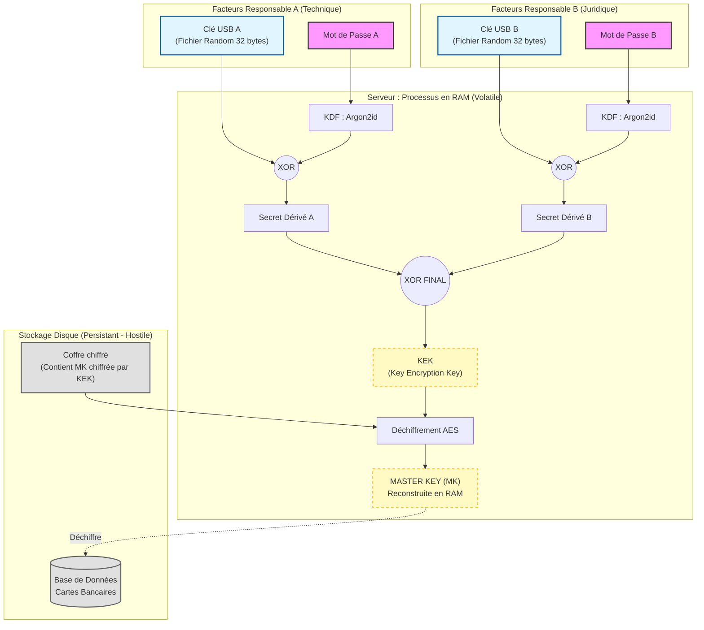

# Architecture de Sécurité & Gestion des Secrets

## 1. Architecture de Sécurité & Gestion des Secrets

### 1.1. Réponse à la problématique de Sécurité par Conception (Security by Design)

**Problématique :**
Conformément aux exigences du GIE Cartes Bancaires, le serveur doit garantir la **confidentialité des données stockées** sans que la sécurité ne repose sur le stockage disque, l'intégrité du système d'exploitation, ou la confiance en un administrateur unique. Le déchiffrement doit impérativement nécessiter la présence simultanée de **deux responsables authentifiés par deux facteurs**.

**Solution Proposée : Le Chiffrement par Enveloppe (Key Wrapping) et Secret Partagé.**
Notre architecture repose sur le principe de **Non-Persistance de la Clé Maîtresse**. La clé de déchiffrement des données ($K_{Master}$) n'est jamais écrite sur le disque dur. Elle est reconstruite de manière éphémère en mémoire vive (RAM) **uniquement** lors de la procédure de **"Cérémonie des Clés"**.

### 1.2. Spécification des Facteurs d'Authentification

Pour chaque responsable $R_i$ (Technique et Juridique), l'authentification forte repose sur :

*   **Ce que je sais (Facteur Memorable) :** Un mot de passe fort ($P_i$).
*   **Ce que je possède (Facteur Physique) :** Un fichier de clé cryptographique aléatoire ($KeyFile_i$) de 256 bits, stocké sur un support amovible (USB).

### 1.3. Algorithme de Reconstruction (Zero-Knowledge)

La sécurité du système repose sur une chaîne de dérivation cryptographique qui empêche toute reconstitution de la clé si un seul élément est manquant (Attaque par vol de disque ou compromission d'un seul responsable).

L'algorithme proposé est le suivant :

1.  **Dérivation des facteurs individuels :**
    Pour chaque responsable, nous dérivons une clé intermédiaire ($K_{Resp}$) en combinant le mot de passe et le fichier USB. Nous utilisons une fonction de dérivation de clé robuste (KDF) type **Argon2id** (résistant aux attaques GPU) pour le mot de passe, combinée par une opération XOR ($\oplus$) avec le fichier USB.

    $$K_{Resp\_A} = Argon2id(Password_A, Salt) \oplus Contenu\_USB_A$$
    $$K_{Resp\_B} = Argon2id(Password_B, Salt) \oplus Contenu\_USB_B$$

2.  **Reconstitution de la Clé de Déverrouillage (KEK - Key Encryption Key) :**
    Les secrets des deux responsables sont fusionnés pour obtenir la clé qui permet d'ouvrir le coffre-fort numérique.

    $$KEK = K_{Resp\_A} \oplus K_{Resp\_B}$$

3.  **Déchiffrement de la Clé Maîtresse (Unwrapping) :**
    La base de données est chiffrée par une **Clé Maîtresse ($K_{Master}$)** aléatoire. Cette $K_{Master}$ est stockée sur le disque sous forme chiffrée (enveloppée) par la $KEK$.

    $$K_{Master} = AES\_Decrypt(Encrypted\_KeyVault, KEK)$$

**Garantie de sécurité :**
Si l'attaquant vole le disque, il ne possède que la version chiffrée de $K_{Master}$. Sans les clés USB physiques ($U_A, U_B$) **ET** les mots de passe ($P_A, P_B$), il est mathématiquement impossible de générer la $KEK$, et donc impossible de récupérer la $K_{Master}$.

### 1.4. Diagramme de Flux de la Cérémonie de Démarrage



## 2. Implémentation des Services (Conformité Technique)

### 2.1. Réponse à la Question 2 : Choix Technologiques
L'implémentation des services 1.i à 1.v a été réalisée en **Python 3.9+** pour garantir la sécurité des types et l'accès à des primitives cryptographiques auditées.

* **Librairie Cryptographique :** Utilisation stricte de `cryptography.io` (hazmat primitives). Nous n'avons implémenté aucun algorithme de bas niveau "maison", conformément au principe de Kerckhoffs.
* **Algorithme de Chiffrement :** AES-256 en mode **GCM (Galois/Counter Mode)**. Ce mode offre à la fois la confidentialité et l'intégrité des données (Authentificated Encryption), empêchant toute modification inaperçue de la base de données chiffrée.
* **Dérivation de Clé (KDF) :** **Argon2id**. Choisi pour sa résistance aux attaques par canaux auxiliaires (side-channel) et aux attaques GPU, supérieure à PBKDF2.

### 2.2. Cartographie des Services

Le tableau suivant démontre la correspondance entre les exigences du cahier des charges et les fonctions implémentées dans le PoC.

| Exigence | Service | Implémentation (Fichier / Fonction) | Contrôle de Sécurité |
| :--- | :--- | :--- | :--- |
| **1.v** | Initialisation | `setup.py` / `initialisation_service_1_v` | Génération d'aléa cryptographique (`os.urandom`) pour les clés physiques et formatage du Coffre (Vault). |
| **1.i** | Mise en Service | `server.py` / `service_1_i_mise_en_service` | Reconstruction de la MK en RAM uniquement (`/dev/shm`). Nettoyage mémoire après usage. |
| **1.ii** | Ajouter | `server.py` / `service_1_ii_ajouter` | Déchiffrement atomique en RAM. Rotation du vecteur d'initialisation (Nonce) à chaque écriture. |
| **1.iii** | Supprimer | `server.py` / `service_1_iii_supprimer` | Vérification de l'intégrité du fichier avant modification. |
| **1.iv** | Chercher | `server.py` / `service_1_iv_chercher` | Lecture seule, aucune écriture disque. |

### 2.3. Audit du Code Critique (Preuve de Concept)

L'extrait ci-dessous, issu de notre module `crypto_utils.py`, démontre le mécanisme de fusion des secrets qui garantit qu'aucune clé ne persiste.

```python
# Extrait de la fonction derive_part (crypto_utils.py)
# L'opération XOR garantit qu'aucune part ne révèle d'information sur la clé finale.
# Si l'attaquant ne possède que le mot de passe (int_pass), le résultat reste
# statistiquement indiscernable du hasard grâce à int_usb.

int_pass = int.from_bytes(pass_hash, "big")
int_usb = int.from_bytes(usb_secret, "big")
xor_result = int_pass ^ int_usb  # Opération atomique en mémoire